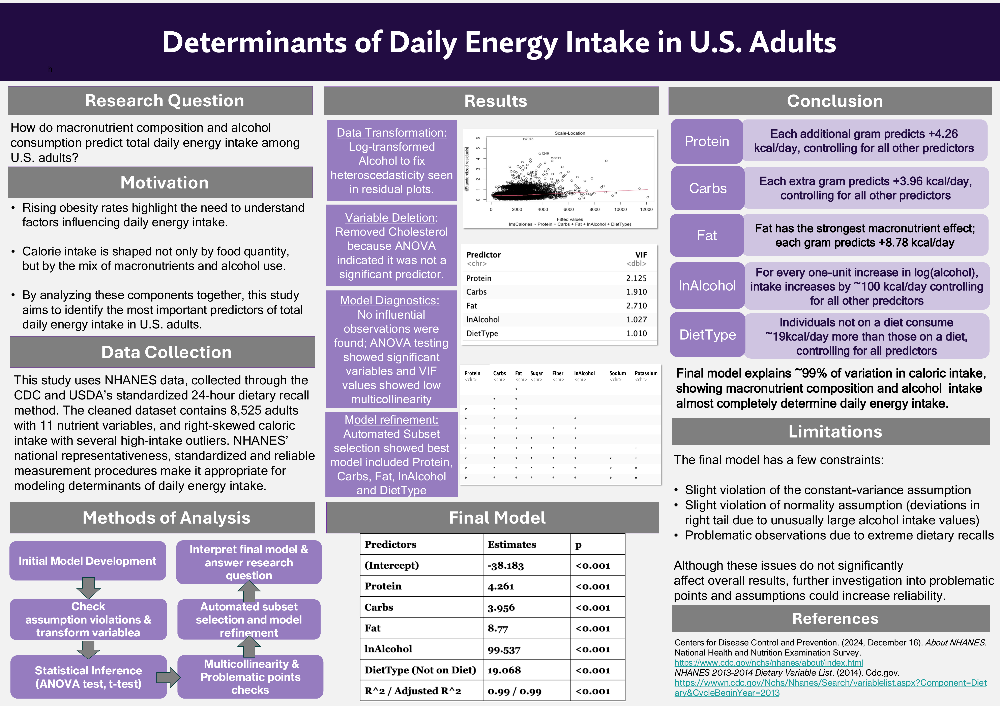

# daily energy intake regression

a linear regression project looking at how macronutrient composition and alcohol intake predict total daily caloric intake in u.s. adults, using NHANES dietary recall data. built for STA302.

---

## the question

how do protein, carbs, fat, and alcohol consumption predict total daily energy intake, and does dieting status change that relationship?

## data

NHANES 2013–2014 dietary recall data (CDC/USDA). the raw file has 160+ variables; the model uses 11: total calories (response), protein, carbs, fat, sugar, fiber, alcohol, cholesterol, sodium, potassium, and self-reported diet status. after dropping NAs and an invalid diet-status code, ~8,500 observations remain.

## method

- fit an initial model with all 11 nutrient variables plus a protein × diet-status interaction
- checked assumptions via residual plots — found heteroskedasticity driven by alcohol, fixed with a log(alcohol + 1) transform
- ran ANOVA/t-tests, checked VIF for multicollinearity, dropped cholesterol (not significant, added collinearity)
- used best-subset selection to settle on a final model: `calories ~ protein + carbs + fat + ln(alcohol) + diet_status`
- checked for influential points (leverage, cook's distance, DFFITS, DFBETAS) — none found

## final model

| predictor | effect |
|---|---|
| protein | +4.26 kcal/day per gram |
| carbs | +3.96 kcal/day per gram |
| fat | +8.78 kcal/day per gram |
| ln(alcohol) | +~100 kcal/day per unit increase |
| diet status (not dieting) | +19 kcal/day vs. dieting, controlling for the rest |

R² / adjusted R² ≈ 0.99.

## limitations

the R² here is misleadingly high and isn't really the headline result — total calories are close to a definitional sum of macronutrient grams (protein/carbs ≈ 4 kcal/g, fat ≈ 9 kcal/g), so the model is largely recovering arithmetic rather than uncovering a deep behavioral relationship. the more interesting reads are the per-gram coefficients (fat's ~2x calorie density per gram shows up cleanly) and the alcohol/diet-status effects, which aren't mechanical. residuals still show mild non-constant variance and some right-tail non-normality from extreme alcohol/recall values — noted but not treated as invalidating the model given the sample size.

## poster

## files

- `project.Rmd` — full analysis (R, tidyverse/dplyr, broom, car, leaps)
- `diet.csv` — raw NHANES dietary recall data
- `poster.pdf` — project poster, full resolution
- `assets/poster.png` — poster image, rendered above

---

built with R (tidyverse, broom, knitr, car, leaps)
